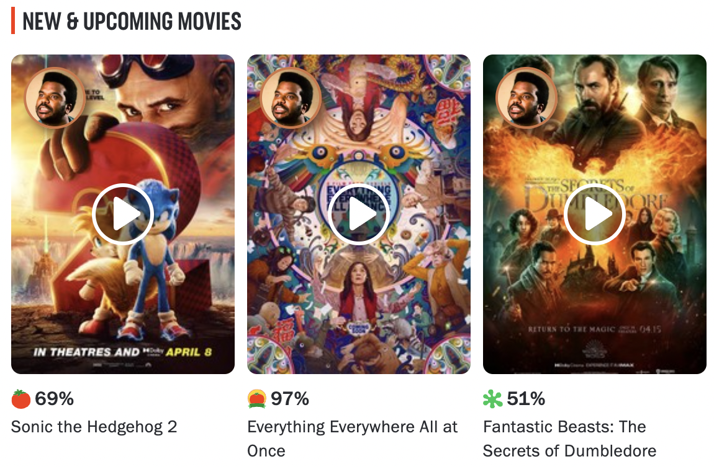

# I SEENT IT!

A silly way to keep track of and rate the movies and shows you've watched.

## Basic Usage

1. Install this Chrome extension.
2. Go to IMDB or Rotten Tomatoes.
3. Look for Craig Robinson's face on movie posters:

## Motivation and Philosophy

### 10-star rating systems are bad and you should feel bad

Nearly a decade ago an article (from a now-defunct website) titled
[Why Ratings Systems Don't Work](https://web.archive.org/web/20201003012536/http://goodfil.ms/blog/posts/2012/08/22/why-ratings-systems-dont-work/)
popped up on Hacker News.

The XKCD comic about star ratings at the top of the article perfectly
encapsulates a major problem with user ratings that is a persistent annoyance:
Excessive granularity.

Even in a 5-star system, a 2-star rating is guaranteed to
be the least used. Doesn't matter what is being rated. It's like a law of
consumer rating physics.

### Single-axis rating systems are even worse

The article goes on to introduce an idea that has stuck with me ever since:
Using a dual-axis rating system for movies.

There's really only two things we care about when we're deciding how to judge a
film. One is the pure entertainment value we personally get from it, and the
other is what we perceive as its artistic merit. The former dominates our
judgements when we're alone and trying to pick a movie on Netflix. The latter
when we're sharing our opinions with others.

Consider a movie that you'd call a "guilty pleasure". The implication is that
everyone knows this is a "bad" movie, but you love to watch it anyway and you've
seen it many times.

At the other end, consider a movie that you wouldn't have watched had it not won
a bunch of awards, yet bored you to tears. You never want to watch that movie
again, yet you can see the technical filmmaking achievements on display that
earned the film so much regonition on its artistic merits.

Obviously, trying to conflate these two disparate concepts into a single magic
number is a fool's errand. The same concept applies to books, music, video
games, etc.

### Rewatchability and Artistic Merit

The natural thing to do is disambiguate these competing judgements and rate
movies on both of these axes.

The first, your personal enjoyment of a film, is best captured as
"rewatchability", a measure of how much you'd enjoy watching the film again.

The second is the perceived "artistic merit" of the film (which the article
calls "quality").

This gives an infinitely clearer picture on how we really feel about a
particular movie. Plus you can make cool scatter plots from the data, and 90% of
the reason that engineers do anything is so they can make cool charts that no
one looks at.

### Order matters

(Just when you thought a README for a meme extension couldn't get any more
pontificatory...)

When you rate a movie with I SEENT IT!, you're first asked to rate its
rewatchability before its artistic merit. This might seem backwards, but its
very intentional.

With any sort of quiz-esque UX, the context created by prior questions affects
the user's answers on subsequent questions. It's like the observer effect but
with surveys.

In this case, the artistic merit score is less impacted by a prior watchability
score than vice-versa. Rewatchability is personal and easy to rate. All one has
to do is think "if this movie was on right now, would I watch it?" and the
answer is instantly clear.

It's the artistic merit we hem and haw over. *An entire industry* exists to
debate the artistic merits of films. They literally hand out PhDs for it. The
cognitive overhead of assigning a rating is trivial for rewatchability, and
nontrivial for artistic merit.

By rating rewatchability first, you avoid having your thoughts colored with
cultural baggage when deciding how much you personally enjoy a film. The effect
of your prior rewatchability score has a comparatively smaller impact on your
artistic merit score. It's easier to "change gears" in one direction, harder in
the other. This strategy also pushes UX friction downstream. A user's motivation
to finish a flow is proportional to the effort they've put in so far. Sunk cost
fallacy FTW!

I just made all of that up but it sounds good. #bikeshedding

### OK so why does this need to be an extension?

A while back I tried to take an inventory of all the movies I'd watched. This
turned out to be much harder than anticipated. I watch too many damn movies. My
manually curated spreadsheet that preceeded this extension had nearly 1000
entries before I gave up.

There were services out there for keeping track of the things you've seen, but
none of them gave me the impression they'd still be around in 10 years.

More importantly, I wanted something I could use passively. I don't want to have
to carve out time to go hunting for movies to add to the list. Every time I was
on sites like Rotten Tomatoes or IMDB, I'd find myself thinking "man it'd be
great if all these movie listings had some UI to track what I've seen". This was
especially true when using these sites to discover new things to watch.

So I built it. And included the One True Rating System. And wrote this novel.

## User Data

Everything is automagically synced to your Chrome profile, so your data will
stay consistent across your devices.

To view your collection and manage your data, open the Options page. Here's one
way to do so:

1. Click the puzzle piece icon to the right of the URL bar.
2. Click the three dot menu icon for the I SEENT IT! extension.
3. Click "Options".

## TODOs

* Better content type handling for IMDB (must use scraping a la Rotten Tomatoes).
* Support text-based filmography lists (needs a mini UI treatment).
* Options page: Data import/export (CSV).
* Options page: Sorting and filtering.
* S C A T T E R P L O T S
